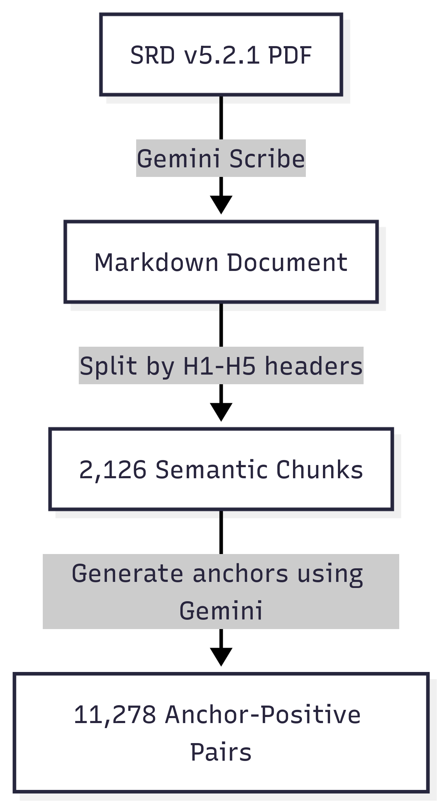

# D&D 5e SRD Anchor-Positive Pairs

[](https://creativecommons.org/licenses/by/4.0/)

> Game System: Dungeons & Dragons 5th Edition (5e)
> Source: System Reference Document v5.2.1
> License: CC-BY-4.0
> Format: JSONL (7.8 MB)

## Overview

This dataset contains 11,278 anchor-positive pairs extracted from the Dungeons & Dragons 5th Edition System Reference Document (SRD) v5.2.1. Each pair consists of a natural language question (anchor) and a semantically relevant text passage (positive) from the official D&D 5e rules.

Designed for fine-tuning embedding models for semantic search and retrieval-augmented generation (RAG) systems for D&D 5e gaming applications.

## Dataset Structure

Each line in the JSONL file contains a single pair:

```json
{
  "anchor": "What is the casting time for the Guards and Wards spell?",
  "positive": "Level 6 Abjuration (Bard, Wizard)\nCasting Time: 1 hour\nRange: Touch..."
}
```

Fields:
- `anchor` (string): Natural language question or query about D&D rules
- `positive` (string): Relevant passage from the SRD that answers the question

## Quick Start

```python
from datasets import load_dataset

# Load from HuggingFace Hub
dataset = load_dataset("gal-gilor/dnd-5e-srd-anchor-positive-pairs")

# Access the data
pairs = dataset['train']
print(f"Total pairs: {len(pairs)}")
print(f"Example anchor: {pairs[0]['anchor']}")
print(f"Example positive: {pairs[0]['positive'][:200]}...")

# Or iterate through pairs
for pair in pairs.select(range(5)):
    print(f"Q: {pair['anchor']}")
    print(f"A: {pair['positive'][:100]}...\n")
```

## Dataset Statistics

| Metric | Value |
|--------|-------|
| Total Pairs | 11,278 |
| File Size | 7.8 MB |
| Source Chunks | 2,126 |
| Avg. Anchor Length | 55 characters |
| Avg. Positive Length | 78 tokens (est.) |
| Min Positive Length | 5 tokens (est.) |
| Max Positive Length | 615 tokens (est.) |

*Token counts estimated using 1 token ≈ 0.75 words approximation (not tied to a specific tokenizer)*

Content coverage: Spells, character classes, monsters, equipment, combat mechanics, conditions, magic items, character creation rules

## Generation Pipeline



1. **PDF → Markdown**: Extract SRD PDF preserving header hierarchy and formatting
2. **Markdown → Chunks**: Split by headers (H1-H5) into semantic sections with parent/sibling metadata
3. **Chunks → Pairs**: Generate 3-5 anchor questions per chunk, filter short chunks (<50 chars)

## Reproduction Instructions

To regenerate this dataset from the source SRD, follow these high-level steps:

### 1. Obtain the SRD
Download the D&D 5th Edition System Reference Document v5.2.1 from [dndbeyond.com/srd](https://www.dndbeyond.com/srd).

### 2. Extract to Markdown
Convert the PDF to structured Markdown format while preserving the document structure.

Approach:
- Extract PDF content to Markdown
- Preserve header hierarchy (section titles and levels)
- Maintain formatting for spell blocks, stat blocks, and tables

Example: [Gemini Scribe](https://github.com/gal-gilor/gemini-scribe), an application to convert PDFs to Markdown

### 3. Chunk Text into Semantic Sections
Split the extracted text into meaningful chunks based on the document's header structure.

Strategy:
- Use header hierarchy (H1 → H5) as natural boundaries
- Keep related content together (parent headers with child sections)
- Track sibling relationships and context for each chunk

Output: Structured chunks with metadata (header level, parents, content)

Example: [markdown-mcp](https://github.com/gal-gilor/markdown-mcp), an MCP server for semantic Markdown chunking

### 4. Generate Anchor Questions
Use an LLM to generate anchor questions for each chunk. This dataset uses Google Gemini 2.5 Flash.

Process:
- Prompt an LLM to generate anchor questions based on the chunks
- Skip chunks that are too short or lack sufficient information
- Ensure anchors are semantically aligned with their source chunks

Filtering: Two-layer filtering ensures quality:
- Code validation: Skips chunks shorter than 50 characters
- Template instructions: The prompt explicitly states "If the chunk is too short or lacks sufficient information, do not generate any anchors"

See the full [Anchor Generation Prompt Template](#anchor-generation-prompt-template) below.

### 5. Create Anchor-Positive Pairs
Combine the generated questions (anchors) with their corresponding source chunks (positives) to create the final dataset.

Format: JSONL with `{"anchor": "question", "positive": "chunk_text"}` structure

Estimated cost: ~$3 for the full SRD (2,126 chunks) using Gemini 2.5 Flash

### Implementation
Reference implementation available at [github.com/gal-gilor/roll-to-quest](https://github.com/gal-gilor/roll-to-quest)

### Anchor Generation Prompt Template

```markdown
<task>
You are an expert in semantic query generation and D&D lore. Your task is to analyze a provided D&D-related text chunk and extract as many anchor queries as possible. These queries will be paired with the text chunk for training retrieval models.
</task>

<guidelines>
1.  **Understand the Goal:** Generate natural language questions or queries that this text chunk can answer. These will be used as "anchors" in anchor-positive training pairs where the provided text is the positive (relevant) document. **If the chunk is too short or lacks sufficient information, do not generate any anchors.**

2.  **Define Anchor:**
    *   **Anchor:** A question or query that a user might ask. Frame these as natural questions someone would actually search for - questions that this text chunk directly answers.
    *   Generate diverse query types: factual questions, "how-to" queries, definition requests, relationship queries, etc.
    *   Prioritize clarity and specificity - each anchor should have a clear answer in the provided text.
    *   Aim for 3-5 anchors per chunk (more if the chunk is information-dense).

3.  **Strategy for Anchor Generation:**
    *   **Read Thoroughly:** Analyze the D&D text chunk to identify all answerable questions.
    *   **Multiple Perspectives:** Generate queries from different angles - who, what, where, when, why, how.
    *   **Natural Language:** Write queries as real users would ask them, not as formal database queries.
    *   **Coverage:** Aim to cover the main topics and sub-topics in the text chunk.
    *   **Specificity:** Prefer specific questions over generic ones. "What weapon does Elara use?" is better than "What is in this text?"

4.  **Quality Guidelines:**
    *   Each anchor must be answerable from the provided text
    *   Anchors should be specific enough to distinguish this chunk from others
    *   Avoid overly generic queries like "What is D&D?" or "Tell me about this"
    *   Prefer questions that require the full context of the chunk
    *   Use natural, conversational language
</guidelines>

<source_text>
{{ text }}
</source_text>

<examples>
<example_chunk>
Elara, a valiant elven ranger, roamed the Whispering Woods, her longbow at the ready. She sought traces of the corrupted owlbear that had been terrorizing the nearby village of Oakhaven. Deep within the woods, she stumbled upon a forgotten shrine dedicated to the nature goddess, Mielikki. Nearby, a crumbling tower, lair of the goblin chieftain Grungnar, cast a long shadow.
</example_chunk>

<responses>
<response_1>
Anchor: "Who is Elara?"
</response_1>

<response_2>
Anchor: "What creature is terrorizing Oakhaven?"
</response_2>

<response_3>
Anchor: "Where did Elara find the shrine to Mielikki?"
</response_3>

<response_4>
Anchor: "What weapon does Elara carry?"
</response_4>

<response_5>
Anchor: "Who lives in the crumbling tower in the Whispering Woods?"
</response_5>
</responses>
</examples>
```

## License and Attribution

Licensed under [CC-BY-4.0](https://creativecommons.org/licenses/by/4.0/).

This dataset is derived from the Dungeons & Dragons 5th Edition System Reference Document v5.2.1, © Wizards of the Coast LLC, licensed under CC-BY-4.0.

### Usage Terms

You may:
- Use for commercial or non-commercial purposes
- Modify, adapt, and build upon this dataset
- Train models and deploy applications using this data

You must:
- Attribute Wizards of the Coast as the source of the SRD content
- Include a link to the [CC-BY-4.0 license](https://creativecommons.org/licenses/by/4.0/)

### Recommended Attribution

> This work uses the D&D 5e SRD Anchor-Positive Pairs dataset by Gal Gilor, derived from the Dungeons & Dragons 5th Edition System Reference Document v5.2.1, © Wizards of the Coast LLC (CC-BY-4.0).

## Citation

```bibtex
@misc{gilor2025dnd5e_srd_pairs,
  author = {Gilor, Gal},
  title = {D\&D 5e SRD Anchor-Positive Pairs Dataset},
  year = {2025},
  publisher = {HuggingFace},
  url = {https://huggingface.co/datasets/gal-gilor/dnd-5e-srd-anchor-positive-pairs},
  note = {Derived from D\&D 5th Edition System Reference Document v5.2.1, Wizards of the Coast LLC, CC-BY-4.0}
}
```

## Limitations

### Scope
- **SRD only**: Core D&D 5e subset (excludes Xanathar's, Tasha's, etc.)
- **Static snapshot**: Based on SRD v5.2.1

### Data Quality
- **LLM-generated anchors**: May have occasional phrasing issues
- **Header-based chunking**: Some passages truncated at section boundaries
- **Filtering**: Chunks <50 chars automatically skipped

### Known Biases
- SRD emphasizes combat mechanics over roleplay
- Queries favor explicit rule lookups over interpretive questions

## Contact & Contributions

- Repository: [github.com/gal-gilor/roll-to-quest](https://github.com/gal-gilor/roll-to-quest)
- Issues: [Report bugs or request features](https://github.com/gal-gilor/roll-to-quest/issues)
- Author: Gal Gilor

---

Version 1.0 | Last Updated: January 2025
